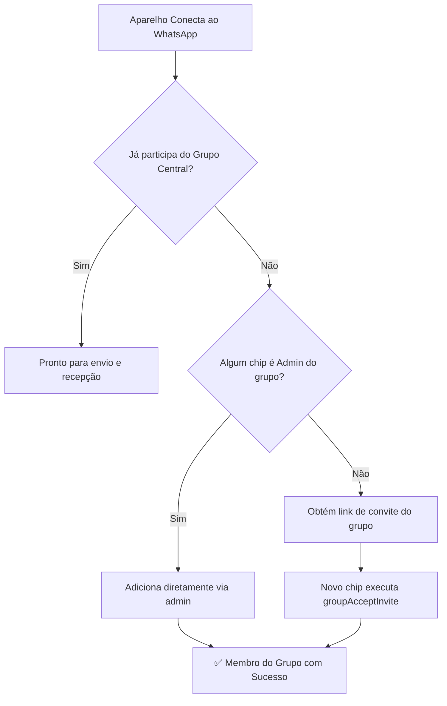

# Arquitetura WhatsApp: Pool de 2 a 8 Números, Auto-Inclusão e Forward Nativo de Mídias 📱🚀

> **Última atualização**: Setembro 2026 — Race condition corrigido, lock de serialização de grupo, aviso visual de falha de ingresso (`groupJoinError`) implementado.

Esta documentação descreve a arquitetura do motor WhatsApp do **MikroGestor**, projetada para alta disponibilidade, blindagem anti-banimento (anti-bloqueio da Meta), balanceamento de carga entre múltiplos chips e encaminhamento nativo de mídias sem re-upload.

---

## 📑 Sumário
1. [Visão Geral & Desafios Solucionados](#1-visão-geral--desafios-solucionados)
2. [Pool Multi-Device: 2 até 8 Números Simultâneos](#2-pool-multi-device-2-até-8-números-simultâneos)
3. [Grupo Central de Mídias & Auto-Inclusão Autônoma](#3-grupo-central-de-mídias--auto-inclusão-autônoma)
4. [Biblioteca de Mídias com Forward Nativo (`relayMessage`)](#4-biblioteca-de-mídias-com-forward-nativo-relaymessage)
5. [Régua de Disparos & Gatilhos Customizáveis](#5-régua-de-disparos--gatilhos-customizáveis)
6. [Fluxo Operacional Passo a Passo](#6-fluxo-operacional-passo-a-passo)
7. [Guia de Troubleshooting & Verificação](#7-guia-de-troubleshooting--verificação)

---

## 1. Visão Geral & Desafios Solucionados

### 🛑 O Problema Tradicional:
- Provedores e operadores de hotspot com apenas 1 número de WhatsApp frequentemente sofrem bloqueio/banimento por enviar dezenas ou centenas de mensagens repetidas (vouchers, cobranças PIX, boas-vindas).
- O reenvio de imagens e vídeos fazendo upload de arquivo (uploading 2MB a cada voucher enviado para 500 pessoas = 1GB de dados consumidos no servidor e risco imediato de detecção por spam da Meta).
- Dificuldade operacional para sincronizar grupos de mídias em múltiplos chips.

### 🟢 A Solução MikroGestor:
- **Pool de 2 até 8 números Baileys** conectados simultaneamente, revezando as mensagens de forma circular (Round-Robin).
- **Failover automático**: se o chip da vez sofrer oscilação de sinal ou limite temporário, o próximo chip assume na mesma hora.
- **Grupo Central de Mídias**: um único grupo no WhatsApp onde você posta banners, fotos promocionais, tutoriais ou áudios.
- **Auto-Inclusão Autônoma**: qualquer novo número conectado ao sistema entra no grupo central **automaticamente**, usando o código de convite via Baileys (`groupAcceptInvite`), sem necessidade de convite manual.
- **Forward Nativo (`relayMessage`)**: a mídia enviada no grupo já está hospedada e criptografada nos servidores da Meta. Ao disparar aos clientes, o sistema encaminha o payload original como se fosse um humano reencaminhando a mensagem. **Upload zero de arquivos, economia total de banda e camuflagem humana.**

---

## 2. Pool Multi-Device: 2 até 8 Números Simultâneos

### 2.1 Balanceamento Round-Robin Circular
O gerenciador central (`BaileysService`) monitora constantemente todos os sockets em memória:

```typescript
// Coleta apenas instâncias ativas e autenticadas
const readySessions = Array.from(this.sessions.values()).filter(s => this.isSocketReady(s));

// Seleciona o próximo aparelho na sequência circular
const startIndex = this.roundRobinIndex % readySessions.length;
this.roundRobinIndex = (this.roundRobinIndex + 1) % readySessions.length;
```

Se você tem 4 números conectados:
1. Mensagem 1 -> Disparada pelo Chip 1 (`554497743598`)
2. Mensagem 2 -> Disparada pelo Chip 2 (`554497743552`)
3. Mensagem 3 -> Disparada pelo Chip 3
4. Mensagem 4 -> Disparada pelo Chip 4
5. Mensagem 5 -> Retorna ao Chip 1, mantendo equilíbrio perfeito de volume.

### 2.2 Resiliência com Failover Automático
Caso o envio pelo chip selecionado encontre qualquer falha passageira (queda de conexão Wi-Fi do celular, timeout de socket), o sistema não devolve erro ao cliente. Ele passa imediatamente para o próximo número da lista:

```typescript
for (const session of sessionPool) {
  try {
    const result = await this.sendViaSingleSession(session, to, text, options);
    if (result.success) return result;
  } catch (err) {
    console.warn(`[BaileysManager] Falha no chip ${session.name}. Tentando próximo da rotação...`);
  }
}
```

---

## 3. Grupo Central de Mídias & Auto-Inclusão Autônoma

### 3.1 Por que todos os números precisam estar no grupo?
Nos protocolos do WhatsApp, para que um chip consiga reencaminhar (`relayMessage`) uma mídia existente nos servidores da Meta usando `mediaKey` e `fileSha256`, os servidores verificam se o remetente tem autorização de acesso ao chat onde a mídia foi compartilhada originalmente. Ao fazer com que todos os seus 2 a 8 chips sejam membros do grupo central, todos ganham permissão oficial de reenvio!

### 3.2 Como funciona a Inclusão Autônoma:
Quando um novo chip se conecta (`connection === 'open'`):



Logs reais capturados em produção:
```log
[Baileys][fe76e0d1] Conectado e autenticado! Número: 554497743552
[Baileys][AutoGroup] Aparelho WhatsApp Chip 2 (554497743552) NÃO está no grupo central. Ingressando automaticamente...
[Baileys][AutoGroup] Aparelho WhatsApp Chip 2 entrando no grupo via código "HafReQReeZBGewowerVBvO"...
[Baileys][AutoGroup] ✅ Aparelho WhatsApp Chip 2 (554497743552) entrou no grupo central com sucesso via convite!
```

---

## 4. Biblioteca de Mídias com Forward Nativo (`relayMessage`)

### 4.1 Captura Robusta de Mídias
Tudo o que for enviado no grupo de mídias (por você no celular do bot ou por qualquer outro membro) é interceptado pelo listener de mensagens do Baileys:
- Desembrulha recursivamente envelopes (`ephemeralMessage`, `viewOnceMessageV2`, `documentWithCaptionMessage`).
- Detecta imagens, vídeos, áudios e documentos.
- Extrai a thumbnail em base64 (`jpegThumbnail`) para visualização instantânea no painel.
- Salva o payload completo em formato JSON na tabela `MediaLibrary`.

### 4.2 Reenvio Humano (`relayMessage`)
Quando um cliente final deve receber uma mídia anexada à mensagem:
1. O sistema carrega o payload original gravado em `MediaLibrary`.
2. Utiliza `generateForwardMessageContent` para reconstruir o pacote Protobuf com flag de reencaminhamento humano.
3. Executa `session.sock.relayMessage(jid, forwardContent, {})`.
4. O cliente recebe o vídeo ou foto com alta velocidade, com resolução original e **sem nenhum upload feito pelo seu servidor**.

---

## 5. Régua de Disparos & Gatilhos Customizáveis

Os seguintes gatilhos nativos suportam mídia via Biblioteca (`forwardLibraryId`) e upload convencional:

| Gatilho (`key`) | Descrição | Modo |
| :--- | :--- | :--- |
| `WA_MSG_WELCOME_PAID` | Boas-vindas com credenciais, cortesia e canais oficiais | Pago |
| `WA_MSG_PIX_GENERATED` | Envio de chave PIX Copia e Cola e resumo do pedido | Pago |
| `WA_MSG_PAYMENT_APPROVED_HOTSPOT` | Notificação de pagamento aprovado e liberação total | Pago |
| `WA_MSG_VOUCHER_DELIVERY` | Entrega de voucher avulso gerado pelo operador | Ambos |
| `WA_MSG_EXPIRATION_WARNING` | Alerta de renovação quando o tempo está acabando | Pago |
| `WA_MSG_EXPIRATION_ALERT` | Notificação de corte por encerramento de plano | Pago |
| `WA_MSG_PROMOTIONAL` | Campanhas de remarketing e promoções | Ambos |

Todos os envios utilizam a função central:
```typescript
const sendOpts = await getTriggerSendOptions(step.key);
await whatsappService.sendWhatsAppMessage('admin', phone, msgText, {
  media: sendOpts.media,
  forwardLibraryId: sendOpts.forwardLibraryId,
});
```

---

## 6. Fluxo Operacional Passo a Passo

1. **Acesse o Painel:**
   Vá em **Configurações → WhatsApp** (`/dashboard/whatsapp`).
2. **Conecte seus Aparelhos:**
   Clique em `+ Adicionar Aparelho WhatsApp` e leia o QR Code ou use o Código de Pareamento de 8 dígitos para conectar de 2 a 8 números.
3. **Selecione o Grupo da Biblioteca:**
   No card de qualquer aparelho conectado, clique em **"Escolher Grupo"**. O sistema consulta o WhatsApp e lista os grupos pelo nome. Selecione o grupo desejado e marque a caixa:
   > *"Vincular este mesmo grupo para os outros números cadastrados"*
4. **Envie as Fotos e Vídeos:**
   Abra o WhatsApp e envie qualquer foto, banner, vídeo ou áudio no grupo.
5. **Vincule aos Modelos de Mensagens:**
   Vá em **Configurações → WhatsApp → Modelos de Mensagens**.
   Selecione o gatilho desejado, clique na aba **"Biblioteca de Mídias"**, selecione a mídia desejada e clique em **"Salvar Modelo"**.

---

## 7. Guia de Troubleshooting & Verificação

### Como verificar se os aparelhos estão no grupo via console na VPS:
```bash
docker exec -it <CONTAINER_ID> node -e "
const { PrismaClient } = require('@prisma/client');
const prisma = new PrismaClient();
prisma.whatsappInstance.findMany({
  where: { libraryGroupJid: { not: null } },
  select: { name: true, number: true, libraryGroupJid: true, libraryGroupName: true }
}).then(console.log).finally(() => prisma.\$disconnect());
"
```

### Como verificar a quantidade de mídias catalogadas:
```bash
docker exec -it <CONTAINER_ID> node -e "
const { PrismaClient } = require('@prisma/client');
const prisma = new PrismaClient();
prisma.mediaLibrary.count().then(c => console.log('Mídias:', c)).finally(() => prisma.\$disconnect());
"
```
