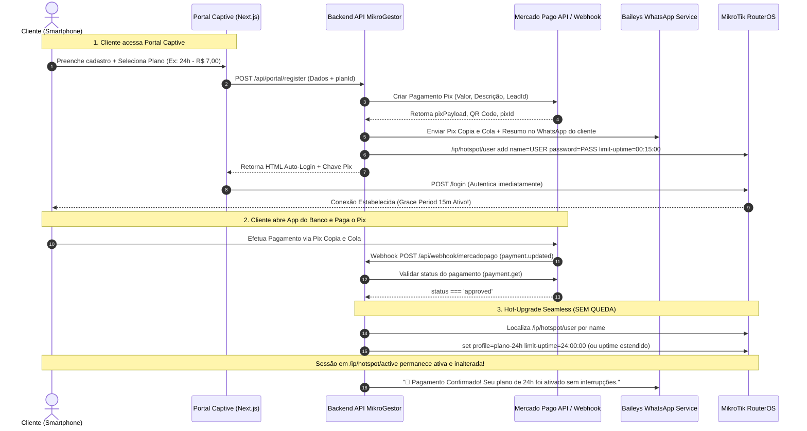

# Prompt de Engenharia de Prompt e Análise Estrutural: Venda de Planos Hotspot no Cadastro (Wi-Fi Grátis vs Venda Pix com Grace Period de 15 Minutos & Hot-Upgrade Seamless)

> **Papel dos Especialistas:** `[architecture]`, `[backend-specialist]`, `[frontend-specialist]`, `[mikrotik-script-specialist]`, `[UX/UI Designer - Design Thinking]`  
> **Objetivo:** Implementar o motor de monetização híbrida no MikroGestor: alternância dinâmica entre modo "Wi-Fi Grátis" (cadastro direto) e "Venda de Planos no Cadastro" (seleção de plano, geração de Pix Mercado Pago, envio instantâneo via WhatsApp, liberação imediata de 15 minutos de tolerância para pagamento e Hot-Upgrade da sessão no MikroTik via Webhook sem derrubar o cliente).

---

## 1. Contexto, Problema e Visão Geral

### 1.1 O Desafio Operacional
Em ambientes de Hotspot Captive Portal (provedores, eventos, comércios, condomínios), a conversão de vendas via Pix sofre com um gargalo clássico: **"O Ovo ou a Galinha"**:
- Para pagar um Pix no app do banco, o smartphone do cliente **precisa de conexão com a internet**.
- Se o portal bloquear a internet até o pagamento ser aprovado, o cliente não consegue abrir o banco para pagar o Pix, a menos que possua 4G/5G com sinal no local (o que frequentemente não ocorre em áreas remotas ou interiores de prédios).

### 1.2 A Solução Arquitetural MikroGestor
1. **Modo 1: Wi-Fi Grátis (Legado/Cortesia - Sempre disponível)**:
   - Formulário de autoatendimento padrão.
   - Não gera cobrança nem código Pix.
   - Libera o acesso padrão configurado (ex: cortesia ou perfil free).
2. **Modo 2: Venda de Planos no Cadastro (Monetização Automatizada)**:
   - O administrador ativa o toggle *"Modo Venda de Planos"* no painel MikroGestor.
   - No formulário de cadastro, é renderizado um catálogo dinâmico com os planos ativos (Nome, Preço, Duração e Velocidade).
   - O cliente seleciona o plano desejado e envia o cadastro.
   - **Geração Pix & WhatsApp**: O backend gera a cobrança Pix via Mercado Pago (Copia e Cola + QR Code) e despacha imediatamente a chave e o resumo da compra para o WhatsApp do cliente via Baileys.
   - **Grace Period (15 Minutos de Tolerância)**: O sistema cria o usuário no MikroTik Hotspot com `limit-uptime=00:15:00` e autentica o smartphone imediatamente via POST no `/login` do Hotspot. O cliente navega na hora!
   - **Hot-Upgrade Seamless (Sem Queda)**: Quando o cliente efetua o pagamento no banco, o webhook do Mercado Pago valida a transação (`status: approved`). O backend atualiza o usuário no MikroTik para o perfil e tempo total do plano comprado **sem derrubar a sessão ativa (`/ip/hotspot/active`)**. O cliente continua navegando ininterruptamente com seu plano estendido.

---

## 2. Análise Estrutural em 4 Camadas

### 2.1 Análise Morfológica (Interface do Cadastro & Checkout)
1. **Seletor de Planos Desencaixotado**:
   - Cards de planos em formato de cartões de decisão limpos, com badges de destaque (*Mais Popular*, *Melhor Custo-Benefício*).
   - Tipografia de alto contraste com valor monetário evidente (`R$ 5,00`, `R$ 15,00`) e tempo de validade (`1 Hora`, `24 Horas`, `7 Dias`).
   - Radio buttons ou seleção estilo *pill* com contorno de foco MikroTik Blue (`#006eff`). **Purple Ban Estrito** (sem gradientes ou cores roxas/violetas).
2. **Modal/Painel de Checkout Pix Pós-Cadastro**:
   - Mensagem de status empática: *"Conectado! Você tem 15 minutos de cortesia para realizar o pagamento do seu Pix."*
   - Componente de QR Code vetorial renderizado localmente (`QRCodeSVG`) e input com código Copia e Cola + botão de ação direta *"Copiar Chave Pix"*.
   - Timer regressivo visual dos 15 minutos de tolerância.
   - Polling de verificação em background com indicador de aguardo não-bloqueante.

### 2.2 Análise Sintática (Fluxo de Dados e Ciclo de Vida do Cliente)



### 2.3 Análise Taxonômica (Classificação de Dados & Configurações)

1. **Configurações Globais (`SystemConfig`)**:
   - `PORTAL_SALE_MODE`: `"free"` | `"paid"` (Define se o portal opera em modo Wi-Fi Grátis puro ou com Venda de Planos).
   - `GRACE_PERIOD_MINUTES`: Duração padrão da tolerância de pagamento (Default: `15`).
   - `MERCADOPAGO_TOKEN`: Credencial de acesso para emissão do Pix.
   - `PIX_MANUAL_KEY`: Chave Pix manual cadastrada (opcional, para fallback caso não use API Mercado Pago).
2. **Entidades de Domínio**:
   - `WhatsappPlan` / `HotspotPlan`: `id`, `title`, `price`, `profile` (nome do profile no RouterOS), `uptimeLimit` (tempo em formato RouterOS: `01:00:00`, `1d 00:00:00`, etc.), `active`.
   - `HotspotLead`: `hotspotUser`, `name`, `phone`, `cpf`, `password`.
   - `Payment`: `pixId`, `status` (`pending`, `approved`, `expired`), `amount`, `profile`, `planId`, `leadId`.

### 2.4 Análise Heurística (Nielsen & Design Thinking)
1. **Visibilidade do Status do Sistema (Heurística 1)**: O cliente sabe exatamente que está conectado e que possui 15 minutos para efetuar o pagamento. Não há telas de bloqueio abruptas.
2. **Prevenção de Erros (Heurística 5)**: O formulário formata automaticamente o telefone e CPF, garantindo que o WhatsApp receba o Pix mesmo se o cliente fechar a tela do portal.
3. **Consistência e Padrões (Heurística 4)**: O botão de cópia do Pix dá feedback visual tátil (*"Chave Copiada com Sucesso!"*).
4. **Resiliência de Rede**: O acesso provisório de 15 minutos garante que qualquer falha transitória de 4G da operadora do usuário seja neutralizada pelo próprio Wi-Fi do Hotspot.

---

## 3. Especificação Técnica de Implementação

### 3.1 Painel Administrativo (`/dashboard/portal` e `/dashboard/plans`)
- Inclusão do toggle master:
  ```tsx
  <Toggle 
    label="Modo Venda de Planos no Cadastro"
    description="Quando ativo, o cliente seleciona um plano e recebe a cobrança Pix com 15 minutos de internet liberada para pagamento."
    checked={saleModeEnabled}
    onChange={setSaleModeEnabled}
  />
  ```
- Gerenciamento de Planos Hotspot (`WhatsappPlan`):
  - Nome do Plano (ex: `1 Hora`, `1 Dia Turbo`, `Semanal`).
  - Preço em Reais (ex: `R$ 5,00`).
  - Profile MikroTik associado (ex: `plano_1h`, `plano_24h`).
  - Tempo de Limite (`limit-uptime`: `01:00:00`, `1d 00:00:00`, etc.).

### 3.2 Cadastro no Portal (`src/app/api/portal/register/route.ts`)
- Se `PORTAL_SALE_MODE === 'free'`:
  - Mantém o fluxo atual idêntico (cria o usuário, salva lead, libera acesso de cortesia, sem gerar Pix).
- Se `PORTAL_SALE_MODE === 'paid'`:
  - Valida o `planId` selecionado pelo cliente.
  - Gera o pagamento no Mercado Pago via `MercadoPagoService`.
  - Salva o registro em `prisma.payment` com status `pending`.
  - Dispara mensagem no WhatsApp com a chave Copia e Cola e instruções.
  - Cria o usuário no MikroTik com `limit-uptime="00:15:00"` e `comment="Aguardando PIX: {planTitle} | {pixId}"`.
  - Retorna a tela com auto-login e o painel modal com o QR Code Pix e contador regressivo.

### 3.3 Webhook de Confirmação (`src/app/api/webhook/mercadopago/route.ts`)
- Ao receber `payment.updated` com `status === 'approved'`:
  - Localiza o pagamento e o lead correspondente.
  - Conecta no MikroTik RouterOS ativo via `MikrotikAPI`.
  - **Execução do Hot-Upgrade Sem Queda**:
    ```typescript
    // 1. Localizar o usuário no RouterOS
    const users = await mk.getHotspotUsers() as any[];
    const user = users.find(u => String(u['name']) === String(hotspotUser));
    
    if (user) {
      const userId = user['.id'] || user['id'];
      
      // 2. Atualizar o profile e o novo limit-uptime
      // Exemplo: se comprou 24h, atualiza para o tempo do plano contratado
      await mk.updateHotspotUser(userId, {
        profile: plan.profile,
        'limit-uptime': plan.uptimeLimit || 'none',
        comment: `Pago PIX MP: ${payment.pixId} - Plano ${plan.title}`
      });
      
      // 3. NÃO EXECUTAR removeHotspotActiveByUser!
      // A sessão em /ip/hotspot/active continua ativa sem desconectar o cliente!
    }
    ```
  - Dispara mensagem no WhatsApp celebrando a ativação definitiva do plano.

---

## 4. Matriz de Testes & Critérios de Aceite

| Cenário | Entrada | Comportamento Esperado | Status |
| :--- | :--- | :--- | :--- |
| **1. Modo Grátis Ativo** | Cadastro simples preenchido | Conecta direto no Wi-Fi, sem gerar Pix ou exibir cobrança. | Obrigatório |
| **2. Modo Venda Ativo** | Cadastro preenchido + Plano de 24h | Gera Pix MP, envia no WhatsApp, conecta no Wi-Fi por 15 min. | Obrigatório |
| **3. Pagamento Aprovado** | Webhook MP recebe aprovação | Atualiza usuário no MikroTik com novo profile/tempo **sem derrubar a sessão ativa**. | Obrigatório |
| **4. Pagamento Expirado** | Cliente não paga após 15 min | MikroTik esgota os 15 min de uptime e redireciona para o portal. | Obrigatório |
| **5. Sem Internet Externa** | Rede local sem saída externa | O QR Code vetorial e a navegação provisória continuam operando normalmente. | Obrigatório |

---

## 5. Instruções para o Agente Executor

1. **Prioridade de Não-Regressão**: O modo de Wi-Fi Grátis existente não pode sofrer nenhuma alteração de comportamento quando o modo de venda estiver desligado.
2. **Purple Ban Estrito**: Nenhuma cor ou classe roxa/violeta deve ser adicionada aos seletores de planos ou modais de checkout. Usar paleta MikroTik Blue e Slate de alto contraste.
3. **Zero Erros de Compilação**: Todo o código implementado deve passar com `0 erros` em `npx tsc --noEmit` e `npm run lint`.
